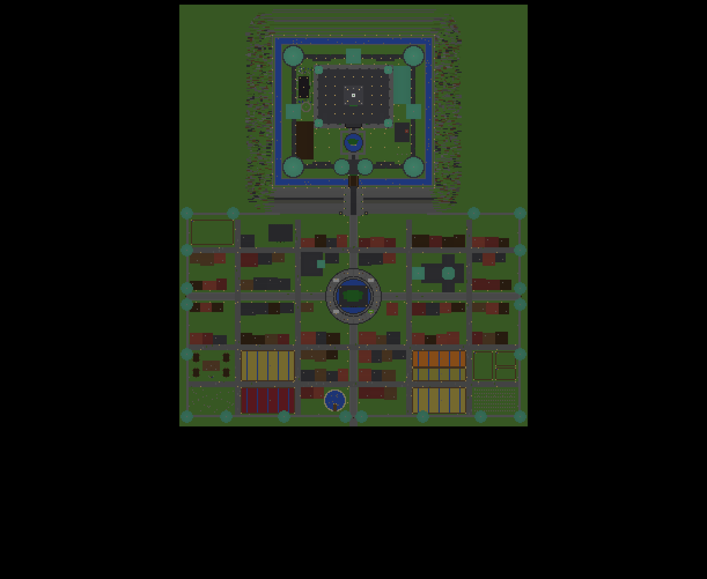
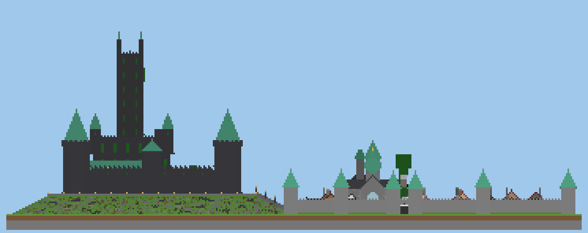
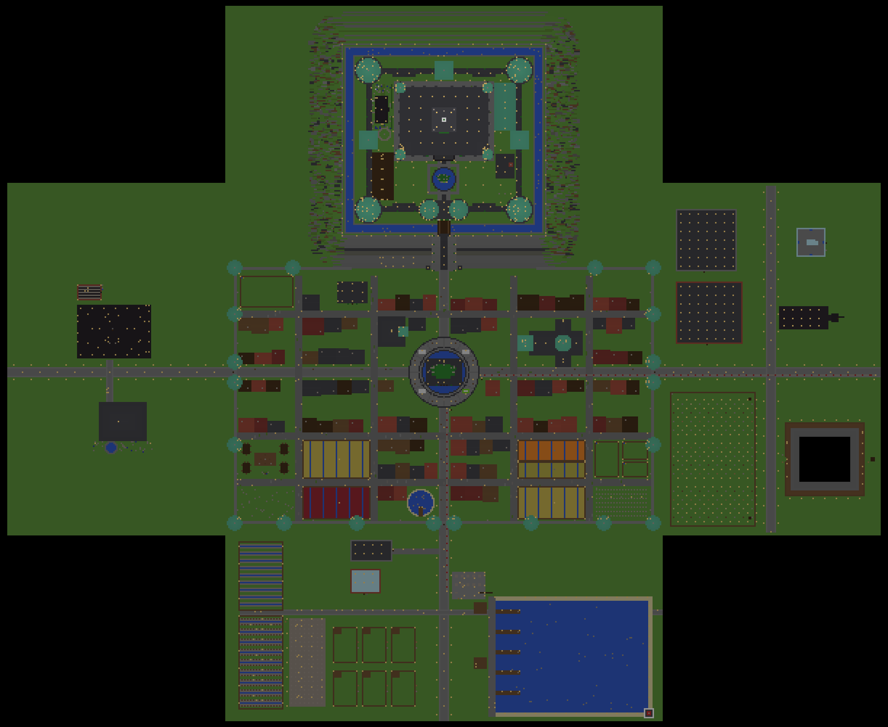
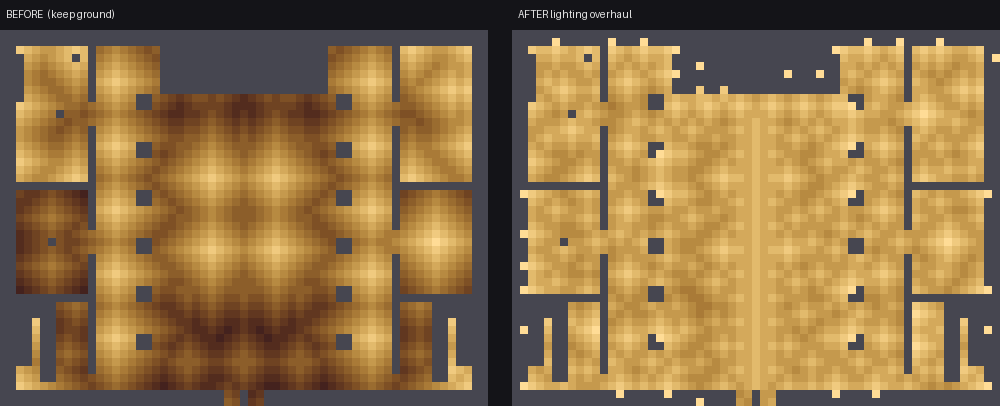
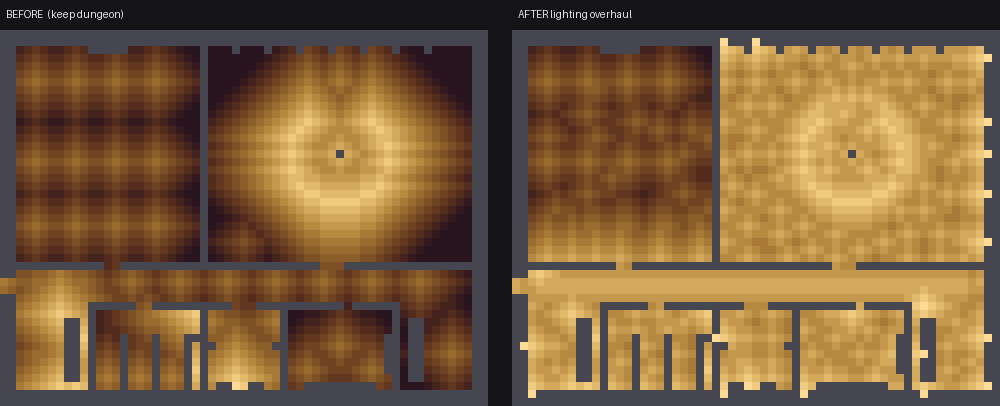
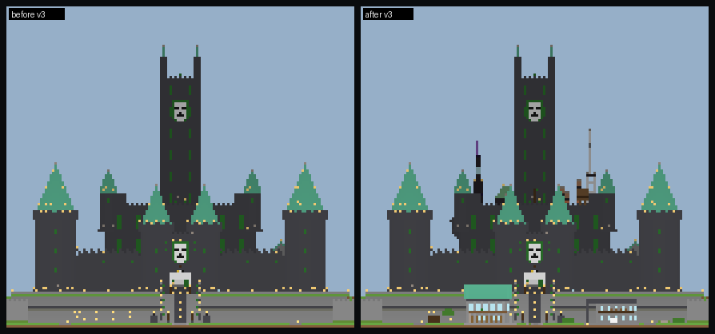

# Latveria — Castle Doom & Doomstadt for Minecraft Java 26.1.2

> **Also in this repository: [`doom-sovereign/`](doom-sovereign/README.md)** — work toward a Doctor Doom
> Fabric mod for 26.1.2 (tested pure-Java core, generated armour/Doombot art, animations, original audio,
> HUD). It has not been compiled against Fabric or run in Minecraft yet; see
> `doom-sovereign/docs/STATUS_REPORT.md`. The command-file builds below are unaffected by it.

A complete, survival-functional Latverian capital: **Castle Doom** on its crag and the walled
town of **Doomstadt** beneath it. It covers about 300 × 365 blocks, and the Doom Tower's
beacon stands about 100 blocks above the plaza. The whole thing is built by a Windows script
that types the construction commands into Minecraft's chat for you, one at a time and at a
gentle pace. You need **no server files, datapacks or mods**, only operator permission.


| Top-down plan | East elevation |
|---|---|
|  |  |

*(These previews are rendered from the actual command list by `generator/preview.py`.)*

---

## Quick start (Windows)

1. **Back up your world.** Everything in the build area is replaced.
2. In Minecraft, pick a **flat, dry spot**. Castle Doom will rise about 70–250 blocks
   **north** (−Z) of you; the town spreads about 110 blocks south and 150 blocks east and west.
3. Stand on the block that will be the **centre of the plaza**. Press **F3** and read the
   `Block:` line (the block your feet are in), e.g. `Block: 120 68 -340`.
4. Make sure you are an **operator** (on a server) or have **cheats on** (single player).
   Creative mode is recommended.
5. Double-click **`windows/Build-Latveria.bat`**, type the three numbers, press Enter,
   then **click back into Minecraft** and leave the keyboard and mouse alone.

The script lifts you onto a glass viewing platform 80 blocks above the plaza and turns off
mob spawning and command spam for the duration. It force-loads the site, waits a minute for
chunks to generate, then builds in 56 named stages while an action-bar message shows progress.
When it finishes, it populates the town, cleans up, restores the game rules and sets you down
in front of the Colossus of Doom.

| Control | Effect |
|---|---|
| **F7** | pause / resume |
| **F10** | stop (progress is saved; run the `.bat` again to resume) |
| click away from Minecraft | pauses automatically, so it can never type into another program |

**Duration:** about 23,400 commands take roughly **75–85 minutes** at the default speed.

### Tuning

Run `Build-Latveria.bat` with parameters (or call the `.ps1` directly):

| Parameter | Default | Use |
|---|---|---|
| `-DelayMs 150` | 60 | pause after every command; raise on a slow or busy server |
| `-ChatOpenMs 150` | 80 | wait after opening chat; raise if some commands go missing |
| `-HeavyFactor 2` | 1.0 | lengthen the extra pauses after big fills |
| `-ChatKey /` | T | if you rebound the chat key |
| `-WindowMatch "Lunar"` | Minecraft | text in your game window's title (for other launchers/clients) |
| `-FromSection "Doom Tower"` | | rebuild from a named stage (list below) |
| `-DryRun` | | only write `latveria_resolved.txt` with the real coordinates, to inspect |

### Troubleshooting

* **Nothing appears or chat opens but stays empty:** raise `-ChatOpenMs`. Check that the chat
  key is T and that no menu or inventory is open.
* **Some areas are missing:** the chunks weren't generated yet when those commands ran. Re-run
  with `-FromSection "<stage name>"`. The site stays force-loaded until the final stage.
* **Kicked for spam** (some Spigot/Paper setups): make sure you are op, or raise `-DelayMs`.
* **"Too many blocks" errors:** the server lowered the `max_block_modifications` game rule.
  Set it back to 32768 or higher.
* The centre's Y must be between −52 and 189 so the dungeons and the top of the Doom Tower fit.

---

## Survival Expansion v2 (second command file)

Run this **after the main build has finished**. It keeps everything already built and adds a
working-capital layer around it. Start **`windows/Build-Latveria-Expansion.bat`** from anywhere
in the world: it already knows your centre (**799 70 −10090**) and only asks you to confirm.
It has about 6,650 commands and takes about **25–30 minutes**. The same controls apply
(F7 / F10 / auto-pause) and it has its own resume file.

| District | What's added |
|---|---|
| **Underground** | Sewers (5-wide, lit, with a water channel) under Doom Boulevard and Werner Avenue, reached by 10 street manholes. The **Great Cistern**, a 51×41 pillared reservoir beneath the south town, is reached from the sewer by a grand stair. **Doom's escape tunnel** runs from a secret door in the dungeon corridor down to the sewers and out to a hermit's hut beyond the west gate, with a provisions chest on the way. |
| **East: Doomwerk** | **Depository**: 120 labelled double chests in 16 categories, plus a receiving bay. **Foundry**: hopper-fed banks of 12 furnaces, 8 blast furnaces and 6 smokers. Load ore in the top chests and fuel in the back chests, and collect from the end chest. **Lava works**: 8 dripstone lava cauldrons, renewable. **Golem Works iron farm**: villager pod, pumpkin-headed zombie, water-channel pads, lava blade, and iron collected in a chest. It starts after the villagers' first night. **Hall of Shadows mob XP farm**: a dark 24×14 spawning hall with stepped channels and a 21-block drop, so you one-hit the mobs through a slot. **Doomwald tree plantation** (saplings and grown trees). A 26-terrace **open-pit quarry**. The **Deep Mine**: a ladder shaft to an iron level (Y≈10) and a diamond level (Y≈−58), each with branch tunnels and supply chests. |
| **South: Southmarch** | **The Exchange**: a trading hall with 22 locked-in, named villagers (librarians, clerics, smiths and more), each behind their job block. **Nursery**: a villager breeder with beds, a farmer and a carrot patch, closed by an iron door with buttons. Sugar cane, pumpkin and melon, and bamboo fields. A **ranch** of six breeding pens (cows, sheep, pigs, chickens, goats, rabbits), each with a feed chest. **Harbour**: a lake with piers, boats, fishermen's huts, a freight yard with a crane, and a lighthouse. |
| **West: West March** | **Mephisto Gate Nether hub**: two lit portals, a lodestone and a Nether wart farm on soul sand. The **Ambassador's Manor**, a home for you: hearth, full workshop, 12 double chests, an ender chest, a bedroom, an enchanting study, brewing, and a garden with a saddled horse. |
| **Transport** | Two powered minecart lines: Plaza ↔ Doomwerk (270 blocks) and Plaza ↔ Harbour. Parked carts wait at the stations; nudge forward to set off. |
| **Defence** | Arrow batteries in the west, east and south gate turrets. Enter the turret from inside the town and flip a lever to fire across the gate. |
| **Lighting audit** | The generator works out block light across the whole city and the new districts, and adds lanterns wherever a monster could spawn at night. Spots right beside doors or ladders get invisible light blocks instead. |

Everything in the expansion is checked against the model of the finished first build, so nothing
lands on top of it. `generator/verify.py latveria_commands.txt latveria_expansion_commands.txt`
reports **0 problems across 2.72 million blocks and 293 entities**.



---

## Lighting Overhaul (third command file)

Run **`windows/Build-Latveria-Lighting.bat`** after the main build and the expansion. It is
preset to your centre (799 70 −10090), has about 4,900 commands and takes about 20 minutes.
It changes only light. Every change is written as `fill … replace <the block that was
built there>`, so any block you've edited by hand is left alone, and your rebuilt Doombot
factory is skipped entirely.

**Designed features**
* A glowing runner hidden under the throne room's green carpet, Doom-green light bands around
  every pillar, and lit dais edges.
* Glass-over-froglight strips down the dungeon corridor (the same technique as your factory),
  and a ring of light in the Time Platform.
* Flush lights along every castle wall walk, the processional way, the Grand Stair and the keep
  roof, plus green uplights set into the base of every curtain wall.
* A glowing ring and rays on the Plaza of Doom, a lit rim around the Colossus plinth, runway
  lights down the avenues and lanes, and lights along the town wall walk.

**Room-by-room light pass.** Every room of the castle, the town, the sewers and cistern, and
the new districts is modelled for light level. Wherever you would stand in light below 11, it
adds, in order of preference:
* a flush **ceiling coffer**, matched to the ceiling material: shroomlight in wood, ochre froglight
  in deepslate, sea lanterns in stone, and verdant froglight in the dungeons, laboratory and sewers
* a **wall sconce** recessed into a thick wall at eye level
* a **floor inlay**: glass over a froglight where the floor is two blocks deep, otherwise a flush
  light tile
* a lantern, only where nothing else fits

| Standing spots | Average light before → after | Dimmer than 11: before → after |
|---|---|---|
| Castle interiors | 8.9 → 12.2 | 66% → 5.6% |
| Town interiors | 9.9 → 12.1 | 58% → 1.7% |




---

## Refinement v3 (fourth command file)

Run **`windows/Build-Latveria-Refinement-V3.bat`** after the first three layers. It is preset to
your centre (799 70 −10090), has **2,581 commands** in 59 sections, and takes about **15 minutes**.
It is purely **additive**. Every command either places blocks only into air (`keep`), swaps one
exact old block (`replace <old>`), or summons an entity only if a tagged one isn't already there.
There are no gamerules, no forceloads and no kills. You are teleported to each district so its
chunks are loaded. Every section can be run again on its own (`-Section "Golem"`), and resume
is exact.

* **Golem Works fixed.** Flooded pads, glass pod floors, one shuttered window between the
  villagers and the zombie (closed at night so they sleep), and an off lever. Spawn attempts are
  simulated: all 2,204 that find a spot land on the pad.
* **Castle Doom.** An asymmetric roofscape (arcane spire, radio mast, copper observatory, chimneys,
  lab stacks), era weathering, throne dispensers, a spy loft, laboratory zones, a war-room map,
  the **throne hatch** (sticky piston), the **Time Platform lamp sequence**, tapestry passages, an
  oriel study, the **Deep Cells** (linked to the escape tunnel), and a Doombot proving ground. Your
  own factory room is untouched, cell for cell.
* **Doomstadt.** A Chancery and a Palace of Justice at the foot of the Grand Stair, a Market Square
  with stallholders, a public garden and Decree Wall, back yards themed by quarter, street names,
  and worn setts.
* **Districts.** A nursery baby exit and Children's Yard (plus an optional bed reset), the
  **Sorting Office** item sorter (nothing is ever destroyed), Foundry output lamps, harbour shoals
  and a fish market, a windmill, a manor greenhouse, station shelters, alarm bells, and the
  southern approach.

Read [docs/v3/REFINEMENT_V3.md](docs/v3/REFINEMENT_V3.md) for the full guide and the live-test
list, [docs/v3/AUDIT.md](docs/v3/AUDIT.md) for the audit of the executed world, and
[docs/v3/VERIFICATION_REPORT.md](docs/v3/VERIFICATION_REPORT.md) for the numbers.
`python generator/build_refinement.py && python generator/verify3.py` reports **0 structural
problems**. None of it has been run in Minecraft yet.



---

## What gets built

### Castle Doom (north, on a 12-block crag)
* **The crag**: a rugged, layered outcrop of stone, tuff and deepslate, dressed with turf, moss
  and pines.
* **Moat and drawbridge**: a 5-wide stone-lined moat with lily pads, crossed by a timber
  drawbridge with lifting chains.
* **Grand Stair of Doom**: a 15-wide ceremonial ramp from the town up the crag, lined with
  lamp pillars and Doom's banners.
* **Curtain walls**: deepslate-brick walls, 105 × 97 blocks and 17 high, with a walkable
  crenellated wall walk, hanging green banners and courtyard stairways.
* **Towers**: four great round corner towers with 20-block oxidized-copper spires, three
  square wall towers with hipped copper roofs, and two drum towers at the gate. Every tower
  has ladders, floors, beds, chests, fletching and cartography tables, and arrow loops.
* **Gatehouse**: a pointed-arch passage with raised portcullises, murder-hole grates, a guard
  room with dispenser and beds, and an iron-and-green **Doom mask relief** over the gate.
* **Courtyard**: the Fountain of Doom (a 16-block statue), lamp-lit processional way, **royal
  stables** (six saddled, named horses), **forge** (lava hearth, anvils, blast furnaces),
  **barracks** of the Latverian Guard (two floors of bunks), a **Doombot proving ground**, and
  **Cynthia von Doom's memorial garden and mausoleum** with a book of remembrance and an
  amethyst sorcery circle.
* **The Keep** (61 × 47 blocks, four storeys and a roof):
  * **Throne Room**: 15 blocks high with pillars and banners, iron chandeliers, a Doombot
    honour guard, a three-step dais, a blackstone-and-emerald throne between soul-fire
    braziers, and a **13 × 11 stained-glass window of Doom's mask** behind it.
  * Kitchens, dining hall, armoury (iron, diamond, netherite and chainmail suits), guard room.
  * **Library of Sorcery**: bookshelf stacks, a working 15-shelf enchanting alcove, brewing
    stands, and the *Latverian Codex* and Cynthia's *Of the Dark Arts* on lecterns.
  * **Doom's laboratory**: crafter, smithing table, blast furnace, lit redstone consoles, an
    unfinished Doombot on the operating slab, an ender chest, and ancient-city loot.
  * **Gallery of Conquest**: trophies in glow item frames, and a door to **Doom's balcony**
    above the courtyard.
  * **Doom's private chambers**: canopy bed, fireplace, wardrobe of armours, his journal.
    Also the **war room**, with a great map table.
  * **Dungeons**: prison cells with iron doors, the **crypt of the Midsummer portal** (a lit
    Nether portal, since Doom descends each year to fight Mephisto for his mother's soul),
    the **treasury** (gold, emeralds, diamond blocks, end-city and bastion loot), the
    **Doombot factory**, and **Doom's Time Platform** chamber.
  * Two mirrored stairwells link every level, from the dungeon to the roof.
* **The Doom Tower**: rises from the keep roof to Y+100, with seven floors reached by ladder
  (sentinels, the enchanted *Armour of Doom*, alchemy, astronomy, the watch, a great bell).
  It is crowned by copper-tipped pinnacles and a working **Beacon of Doom** whose beam shines
  green through tinted glass.

### Doomstadt (south)
* **The Plaza of Doom**: a radial stone plaza with a fountain moat, market stalls, benches,
  lamp ring and the village bell. In the centre stands the **32-block Colossus of Victor von
  Doom**: hood, iron mask with glowing green eyes, tunic, belt, gauntlets and flowing cloak.
* **Cathedral of Doomstadt**: a cross-shaped nave with a transept, stained-glass lancets, a
  rose window, pews and an altar. It has a copper **onion dome** and a west bell tower with a
  working bell.
* **Rathaus**: the town hall, with a council chamber, archives and a **clock tower** (working
  clocks in its faces).
* About 90 timber-framed houses in six Carpathian palettes, many two-storey. Each has a bed,
  a chest of village loot, a crafting table, a job-site block, lanterns, a smoking chimney
  and a resident villager.
* Named shops: *The Iron Mask* tavern & inn, the Forge (armourer and weaponsmith), toolsmith,
  bakery, the **Werner von Doom Memorial Clinic**, library & school, stonemason, tannery,
  fishmonger.
* **Doombot garrison**: Doombot sentries in formation at the foot of the Grand Stair.
* **Farms**: five fenced fields of ripe wheat, carrots, potatoes and beetroot with irrigation,
  composters and scarecrows. Also pastures of cows, sheep, pigs, chickens and horses.
* **Werner's Camp**: four painted Romani vardo wagons around a campfire, and a memorial stone
  to Werner von Doom, the healer.
* An orchard, an apiary with beehives and a flower meadow, and a fishing pond with a jetty.
* **Town walls**: 10-block walls with a wall walk and ladders, 20 copper-capped turrets, and
  west, east and south gates with portcullises and signs.
* **Life**: over 100 villagers (every profession, with Latverian names), ten iron-golem
  "Doombots", black cats, horses, livestock and bees.

### Landmarks (offsets from your centre block)

| Place | X | Y | Z |
|---|---|---|---|
| Colossus of Doom / plaza | 0 | 0 | 0 |
| Foot of the Grand Stair | 0 | 0 | −70 |
| Castle gate | 0 | 12 | −106 |
| Throne | 0 | 15 | −190 |
| Library / laboratory | −15 / 15 | 28 | −180 |
| Doom's chambers | −14 | 38 | −183 |
| Midsummer portal (dungeon) | 0 | 2 | −157 |
| Beacon of Doom | 0 | 101 | −174 |
| Cathedral doors | 52 | 0 | −20 |
| Rathaus | −26 | 0 | −28 |
| Werner's Camp | −123 | 0 | 60 |

### Build stages
`Preparing the site`, `Clearing the land`, `Levelling the valley`, `Raising the crag`,
`Dressing the crag`, `Cutting the moat`, `The Grand Stair`, `Raising the curtain walls`,
`Wall-walk stairways`, `Corner towers`, `Wall towers`, `The Gatehouse`, `Drawbridge`,
`Courtyard`, `Royal stables`, `The castle forge`, `Barracks`, `Memorial garden`,
`Doombot proving ground`, `The Keep: raising the shell`, `The Keep: facade`,
`The Keep: grand entrance`, `The Throne Room`, `Kitchens`, `Armoury`, `Library of Sorcery`,
`Doom's laboratory`, `Gallery of Conquest`, `Doom's private chambers`, `The war room`,
`The dungeons`, `The prison`, `The crypt`, `The treasury`, `The Doombot factory`,
`Time Platform`, `The Keep: stairwells`, `The Doom Tower`, `Crown of the Doom Tower`,
`Paving the streets`, `The Plaza of Doom`, `The walls of Doomstadt`, `Cathedral`, `Rathaus`,
`Houses of the north quarter`, `Doombot garrison`, `Library and mason's quarter`,
`Houses of the upper town`, `Houses of the lower town`, `Houses of the south quarter`,
`Fields and pastures`, `Animal pens`, `Werner's Camp`, `Orchard, apiary and pond`,
`Bringing Doomstadt to life`, `Final sweep`.

---

## How it works

```
generator/          Python generator (no dependencies) + optional preview/verify tools
  build.py          -> writes windows/latveria_commands.txt
  build_expansion.py -> writes windows/latveria_expansion_commands.txt (needs numpy)
  expansion.py      the Survival Expansion v2 districts, farms and lighting audit
  sim.py            voxel model of the finished world + block-light audit
  build_lighting.py -> writes windows/latveria_lighting_commands.txt (needs numpy)
  lighting.py       the lighting overhaul (designed features + light-level pass)
  lightmap.py       renders docs/light_*.png before/after light maps
  build_refinement.py -> writes windows/latveria_refinement_v3_commands.txt (needs numpy)
  v3core.py         guarded additive builder (keep / replace / idempotent summons / relight)
  v3_*.py           the Refinement v3 content (golem, castle, secrets, city, districts)
  verify3.py        v3 verifier: hygiene, supports, idempotency, darkness, Golem Works simulation
  audit3.py         audit / after renders (docs/v3/audit, docs/v3/after); render3.py draws them
  report3.py        writes docs/v3/VERIFICATION_REPORT.md
  core.py           command engine: validation, chat-length splitting, coordinate tokens
  terrain.py        clearing, crag, moat, Grand Stair
  castle.py         walls, towers, gatehouse, courtyard buildings
  keep.py           the keep, dungeons and Doom Tower
  village.py        Doomstadt
  statue.py         the voxel statue of Doom
  preview.py        renders docs/*.png from the command list      (needs numpy, pillow)
  verify.py         replays the build and checks supports/entities (needs numpy)
  mcdata/           Minecraft 26.1.2 block states and registries (from the game's data)
windows/
  Build-Latveria.bat / .ps1   the chat sender
  latveria_commands.txt       the generated build (23,415 commands)
```

* **Chat-safe:** Minecraft's chat box takes 256 characters. The generator splits anything
  longer. Chest contents go in one slot at a time with `/item replace`. Banner patterns,
  book pages and sign lines are added with `/data modify`. Armour-stand gear is equipped with
  `/item replace entity`. Every line is checked against the limit, assuming worst-case
  coordinate widths.
* **Location-independent:** coordinates are stored as offsets (`$x(12) $y(-3) $z(150)`) and
  turned into absolute numbers by the sender from the centre you type in. Moving, falling or
  teleporting during the build has no effect.
* **Checked against 26.1.2:** every block state is checked against the 26.1.2 block registry,
  and every item, entity, loot table, banner pattern and tree feature against its registry.
  Multi-block pieces (doors, beds, tall flowers) are placed with `strict` so their halves
  survive. `verify.py` replays all 1.58 million placed blocks and confirms that every ladder,
  torch, banner, sign, lantern, lever, crop, bed and door is supported, and that no mob spawns
  inside a block.
* **The sender** uses the Win32 `SendInput` API. For each command it presses the chat key,
  pastes with Ctrl+V and presses Enter, adding extra time after large fills. It only ever
  types while a window whose title contains "Minecraft" is in front.

To change the design, edit the Python files and run `python generator/build.py`. Optionally
run `python generator/verify.py` and `python generator/preview.py` too.
